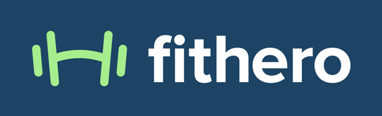
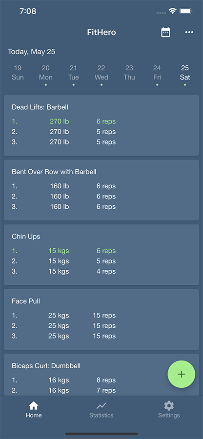
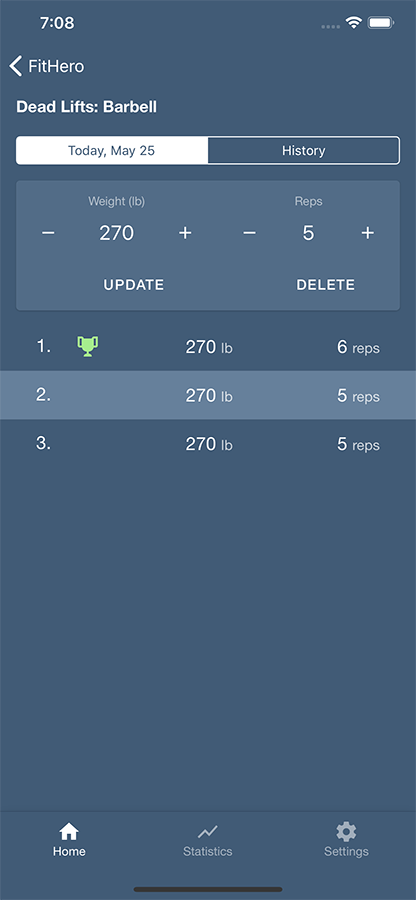
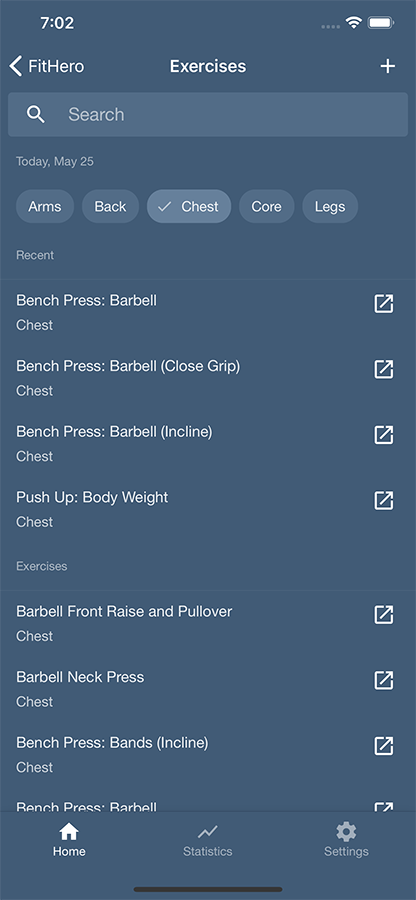
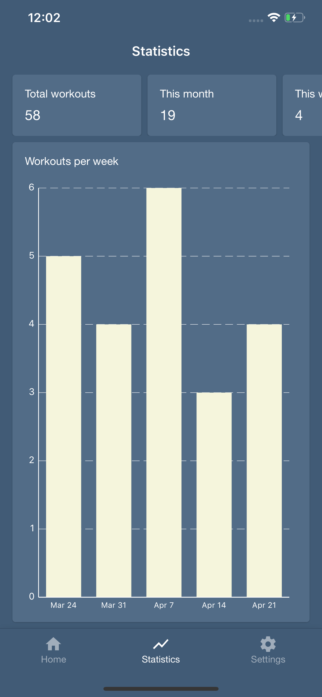
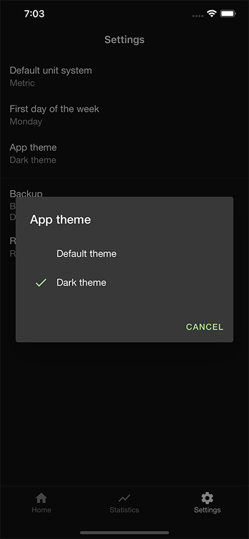

# 

You focus on your training. **FitHero** will focus on the rest. Built with [React Native](https://github.com/facebook/react-native).

## Features

* Log your gym workouts
* Search among ~300 exercises or create your own
* Recent exercises (no need to search anything after a week)
* Calendar view
* Statistics to check your progress
* Dark Theme, Backup and Restore and other settings
* ... and more to come!

  
  
  
  
  

## Feedback & Contributing

Feel free to send us feedback on [Twitter]() or [file an issue](https://github.com/ferrannp/fithero/issues). Feature requests are welcome, however, they need to be discussed and we cannot guarantee that everything will be implemented. Therefore, preparing a detailed RFC (request for changes) is a good idea. If you wish to contribute, please take a quick look at the [CONTRIBUTING.md](./CONTRIBUTING.md) guide.

## License

Created by <a href="https://ferrannp.com">Ferran Negre Pizarro.</a>

FitHero is licensed under the [GNU General Public License v3.0](https://en.wikipedia.org/wiki/GNU_General_Public_License). See more in the See [LICENSE.md](LICENSE) file.

## Acknowledgments

Thanks to the React Native project, the community and every developer that creates and maintains libraries in the open source. This application would not exist without you.
